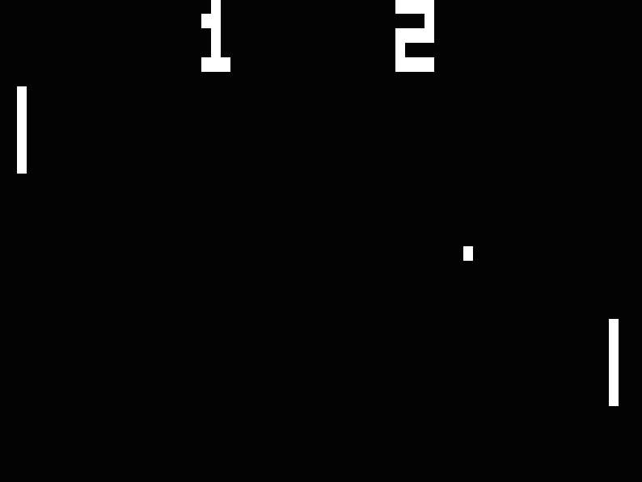

## CHIP-8.js

### Introduction

The goal of this project is to demystify a lot of what goes on "under the hood" of a simple computer system using an understandable and easy-to-learn language like JavaScript.

From [Wikipedia](https://en.wikipedia.org/wiki/CHIP-8):
>CHIP-8 is an interpreted programming language [...] run on a CHIP-8 virtual machine. It was made to allow video games to be more easily programmed for said computers.

This project is a JavaScript implementation of an emulator for CHIP-8's virtual machine. It was created as an educational tool to better understand:
  1. The CPU's fetch-decode-execute instruction cycle
  2. Flow control and memory management
  3. Lower-level design principles

### The CPU

Before high-level scripting languages like JavaScript were invented (and even before their modern-day compiled counterparts like C and Java), programmers needed to use a language that machines could understand. One such language that many computers today understand is called [Assembly](https://en.wikipedia.org/wiki/Assembly_language). Assembly code provides a computer with a set of instructions (simple commands) to act on. The Central Processing Unit (CPU) is then in charge of making sense of (decoding) and carrying out (executing) the instructions. The CPU makes use of a few circuits (which we *emulate* with simple variables) in order to accomplish this. So what do these instructions do?

### Op Codes / Instructions

Before getting too deep into CPUs, let's get Op Codes out of the way (so that you aren't confused when you first see them). An Op Code is generally a type of command that you are issuing to the CPU. An Op Code is usually followed by a value/values that tells the Op Code how to behave. An Op Code plus those values is what comprises an `instruction`. Every CHIP-8 instruction is two bytes (16 bits).

Background: one byte is generally stored as two hexadecimal (base-16) digits (prefixed by `0x` for clarity), as opposed to eight binary (base-2) digits. As an example, all of the following are equivalent representations of the number `twelve`:

- `12` - Base-10 decimal (what you're used to seeing)
- `0x0C` - Base-16 hexadecimal (how we read cpu  instructions)
- `00001100` - Base-2 binary (how data is actually stored)
- `XII` - Roman Numerals (for good measure)

Hexadecimal is basically the closest we can get to how data is stored in the computer, while still being somewhat readable.

##### Examples

**6XNN** - Sets VX to NN, e.g:
  - `6101` - Set register 1 equal to 1.
  - `6424` - Set register 4 equal to 36 (remember this is hexadecimal! `0x24` == `36`).

**3XNN** - Skips the next instruction if VX equals NN, e.g:
  - `3101` - Skip next instruction if register 1 equals 1.
  - `3402` - Skip the next instruction if register 4 equals 2.

**FX15** - Sets the delay timer to VX, e.g:
  - `F415` - Set the delay timer to the value stored in register 4.

There may be some new concepts in these examples, such as registers, but I include them for reference later. (A register is a place where the CPU stores temporary information in-memory)

### Flow Control

A processor can only fetch one instruction at a time. But the power of a computer is not its ability to run instructions sequentially, but in its ability to run them dynamically according to custom rules. We can break out flow control generally into a few different ideas:

1. **Go To** - jump from one instruction to another. Go To forms the basis for modern day loops like `for` and `while`. Basically, when you get to the end of some block of code, you "go to" the start, until some condition is met. Which means it is also related to:
2. **Conditional Branching** - execute different instructions based on some criteria (usually comparing two values or subject to some user input). This forms the basis for `if-else` statements and breaking out of most loops.
3. **Subroutines** - keep track of where the processor is/has executed routines, begin executing new routines, and then fall back to prior routines upon completion. If you ever nest `function` calls within functions calls, your computer needs to know where to go after it finishes each function block.

To accomplish all of the above, we need to store instructions as well as variables, so that we can move around our program and actually do something useful.

### Memory Management

**Registers** - the CHIP-8 system has a few stores of memory. One of the most commonly used is its registers (mentioned earlier). This is where a programmer writing CHIP-8 instructions will store temporary variables to be accessed by later instructions. CHIP-8 has **16** general-purpose registers (`0x0` through `0xF`) that are all 8-bits long (can store `2^8` or `256` values).

CHIP-8 (and almost any processor) also has more specific, private registers. For example, how does the processor know which instruction to `fetch` next? Good question:

**Program Counter (PC)** - this variable stores the address for the next instruction that the processor will evaluate. It's also known as the **instruction pointer**. Every instruction is stored in memory somewhere, and we need something that will point us to the right place.

Okay, so the **PC** will increment from one instruction to the next, but how does it keep track of where it needs to `go to` or return from a `subroutine`? Another great question!

**Stack Pointer (SP)** - one piece of memory I haven't mentioned is the stack. In CHIP-8, the stack stores a list of addresses that the processor may need to return to. A stack data structure is like a deck of cards, where the only way you can store and retrieve information is by pushing or popping cards off the top of the deck. The great thing about a stack is that we only ever have to keep track of the top of the stack - and this is exactly what the **SP** keeps track of!

These variables grant us a lot of power in maneuvering through user space and creating almost any kind of program. (FYI: many of these concepts I've mentioned are what makes a programming language [Turing Complete](https://en.wikipedia.org/wiki/Turing_completeness))

### Architecture

[**CPU**](./src/cpu.js) - Initializes the starting state for its owned objects and starts of the **fetch-decode-execute** loop at a specific `clock_frequency`.

[**MemoryManager**](./src/memory.js) - Provides an interface to main memory access, registers, pointers, the Display, and timers.

[**Instruction**](./src/decoder.js) - Provides a simple API for accessing data from two-byte CHIP-8 instructions through properties like `.x`, `.y`, and `.nnn`.

[**Executor**](./src/executor.js) - Executes instructions according to the CHIP-8 opcode specification.

[**Display**](./src/display.js) - Handles the HTML5 canvas element for rendering and paints display data from the MemoryManager to the screen.

[**KeyboardInput**](./src/input.js) - Handles keyboard input and keyboard await events.

[**HTTPLoader**](./src/loader.js) - Implements the `Loader` interface to get a ROM as an `arraybuffer` from the connected server. Exposes a `read_rom()` method that the CPU uses to load the game into memory.

### Start It Up

Here's how to get the project up and running in a few lines:

    $ git clone https://github.com/APTy/chip8-js.git
    $ npm install
    $ npm start

That should install all the dependencies and start up a server that you can connect to [localhost:3000](http://localhost:3000)!

## Road Map

- Finish implementation of all opcodes
- More information on input and display
- Something about the clock/timers
- Notes about Array Buffers and optimization in JavaScript
