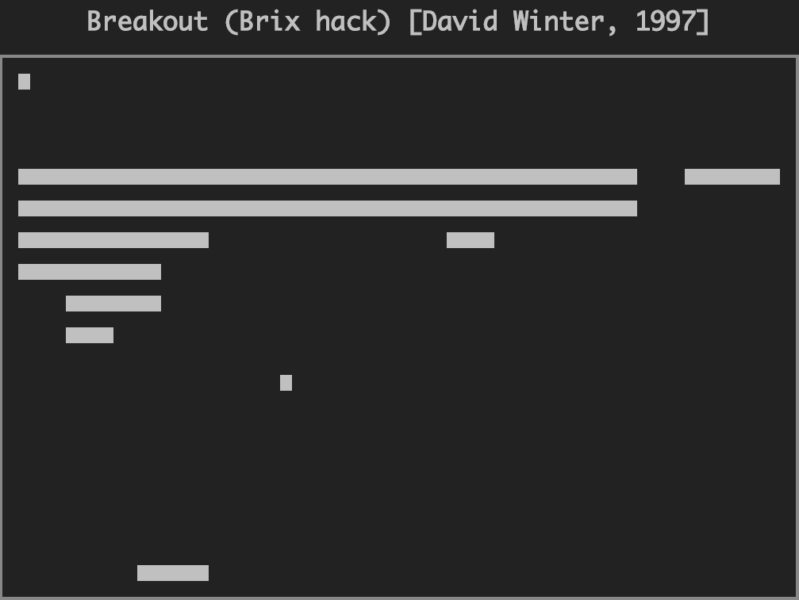

## CHIP-8.js

View a live demo [**here**](http://chip8-js.herokuapp.com/).

### Introduction

From [Wikipedia](https://en.wikipedia.org/wiki/CHIP-8):
>CHIP-8 is an interpreted programming language [...] run on a CHIP-8 virtual machine. It was made to allow video games to be more easily programmed for said computers.

This project breaks down how a simple computer system works. Using JavaScript, we emulate the behavior of the popular CHIP-8 game system. The implementation needs to meet the following requirements:
  1. Byte-code interpretation
  1. Memory management
  1. Flow control
  1. Rendering
  1. User input
  1. Allow anyone to play fun games!

### The CPU

A computer needs simple instructions in order to function. Instructions in the CHIP-8 architecture are two (2) bytes each - pretty small! Instructions are compact and easy for a computer to understand, but not so much for humans.

Languages like C/C++ and Java exist to make programming more user-friendly, but at the end of the day, that code compiles down into a set of simple instructions that a Central Processing Unit (CPU) can understand. The CPU is in charge of making sense of (decoding) and carrying out (executing) the instructions.

The CPU makes use of a few circuits (which we *emulate* with simple variables) in order to accomplish this task. So what do these instructions look like?

### Opcodes / Instructions

Some background with opcodes in case you're unfamiliar with the world of bits and bytes:

An `opcode` refers to a type of command being issued to the CPU. An opcode is usually followed by value(s) that informs the CPU how to behave. An opcode plus those values is what comprises an `instruction`. As mentioned before, every CHIP-8 instruction is 2 bytes (16 bits).

More background: one byte can be stored as two hexadecimal (base-16) digits (prefixed by `0x` when written in code), as opposed to eight binary (base-2) digits. As an example, all of the following are equivalent representations of the number `twelve`:

- `12` - Base-10 decimal (what you're used to seeing)
- `0x0C` - Base-16 hexadecimal (how we read cpu  instructions)
- `00001100` - Base-2 binary (how data is actually stored)
- `XII` - Roman Numerals (for good measure)

Hexadecimal is basically the closest we can get to how data is stored in the computer, while still being readable.

##### Examples

**6XNN** - Sets VX to NN, e.g:
  - `6101` - Set register 1 equal to 1.
  - `6424` - Set register 4 equal to 36 (remember this is hexadecimal! `0x24` == `36`).

**3XNN** - Skips the next instruction if VX equals NN, e.g:
  - `3101` - Skip next instruction if register 1 equals 1.
  - `3402` - Skip the next instruction if register 4 equals 2.

**FX15** - Sets the delay timer to VX, e.g:
  - `F415` - Set the delay timer to the value stored in register 4.

(We'll get into registers in a moment - for now just think of them as variables where a CPU stores data)

### Flow Control

A processor can only fetch one instruction at a time. But the power of a computer is not its ability to run instructions sequentially, but in its ability to run them dynamically according to custom rules. We can break out flow control generally into a few different ideas:

1. **Go To** - Jump from one instruction to another. Go To forms the basis for modern day loops like `for` and `while`. Basically, when you get to the end of some block of code, you "go to" the start, until some condition is met. Which means it is also related to:
2. **Conditional Branching** - Execute different instructions based on some criteria (usually comparing two values or subject to some user input). This forms the basis for `if-else` statements and breaking out of most loops.
3. **Subroutines** - Keep track of where the processor is/has executed routines, begin executing new routines, and then fall back to prior routines upon completion. If you ever nest `function` calls within functions calls, your computer needs to know where to go after it finishes each function block.

To accomplish all of the above, we need to store instructions as well as variables, so that we can move around our program and actually do something useful.

### Memory Management

**Registers** - the CHIP-8 system has a few stores of memory. One of the most commonly used is its registers (mentioned earlier). This is where a programmer writing CHIP-8 instructions will store temporary variables to be accessed by later instructions. CHIP-8 has **16** general-purpose registers (`0x0` through `0xF`) that are all 8-bits long (can store `2^8` or `256` values).

CHIP-8 (and almost any processor) also has more specific, private registers. For example, how does the processor know which instruction to `fetch` next? Good question:

**Instruction Pointer (IP)** - this variable stores the address for the next instruction that the processor will evaluate. It's also known as the **program counter**. Every instruction is stored in memory somewhere, and we need something that will point us to the right place.

Okay, so the **IP** will increment from one instruction to the next, but how does it keep track of where it needs to `go to` or return from a `subroutine`? Another great question!

**Stack Pointer (SP)** - one piece of memory I haven't mentioned is the stack. In CHIP-8, the stack stores a list of addresses that the processor may need to return to. A stack data structure is like a deck of cards, where the only way you can store and retrieve information is by pushing or popping cards off the top of the deck. The great thing about a stack is that we only ever have to keep track of the top of the stack - and this is exactly what the **SP** keeps track of!

These variables grant us a lot of power in maneuvering through user space and creating almost any kind of program. (FYI: many of these concepts I've mentioned are what makes a programming language [Turing Complete](https://en.wikipedia.org/wiki/Turing_completeness))

### Architecture

[**CPU**](./src/cpu.js) - Initializes the starting state for its owned objects and starts of the **fetch-decode-execute** loop at a specific `clock_frequency`.

[**MemoryManager**](./src/memory.js) - Provides an interface to main memory access, registers, pointers, the Display, and timers.

[**Display**](./src/display.js) - Handles the HTML5 canvas element for rendering and paints display data from the MemoryManager to the screen.

[**Clock**](./src/clock.js) - Maintains the internal CPU timing system and schedules events.

[**Instruction**](./src/decoder.js) - Provides a simple API for accessing data from two-byte CHIP-8 instructions through properties like `.x`, `.y`, and `.nnn`.

[**Executor**](./src/executor.js) - Executes instructions according to the CHIP-8 opcode specification.

[**KeyboardInput**](./src/input.js) - Handles keyboard input and keyboard await events.

[**HTTPLoader**](./src/loader.js) - Implements the `Loader` interface to get a ROM as an `arraybuffer` from the connected server. Exposes a `read_rom()` method that the CPU uses to load the game into memory.

### Start It Up

Here's how to get the project up and running in a few lines:

    $ git clone https://github.com/APTy/chip8-js.git
    $ npm install
    $ npm start

That should install all the dependencies and start up a server that you can connect to [localhost:3000](http://localhost:3000)!

### Notes and Road Map

#### Flicker

The screen flickers primarily due to how different ROMs make use of the CHIP-8 API. Instead of calculating the correct position of an object and its shape, and providing the display engine with a proper XOR-able sprite, many games will simply clear that display area, and repaint the same sprite again at a new location. This is evident in games with stationary objects that do not exhibit a flickering behavior.

With this knowledge in mind, we can make an optimization to the display whereby it waits to clear a pixel until it is sure that the pixel should be cleared; that is, if any pixel should be turned off, but will be turned back on within the next frame (or so), we should leave it on. This will smooth any animation roughness, but will add overhead to the rendering process and could also have unpredictable in-game effects.

#### Slow Input Response

It's sometimes noted that game controls are slow or don't register from time to time. This is because games that want to make use of keyboard input must manually check if an input key is pressed or not. So, if a user press a key, but the game is busy running some other logic, it may not receive that input. We could improve the user experience by adding "sticky" keys, and allow user input to linger in memory even after they've released the key. Care should be taken to enforce input buffering and order, so that we don't materially alter the behavior of game logic.

#### Miscellaneous

- Test/debug with more ROMs
- Responsive canvas display size
